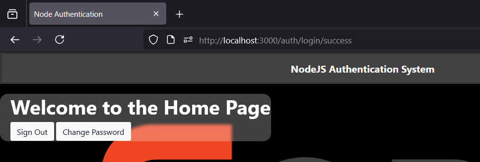

# Node.js Authentication System

This project contains a complete authentication system using Node.js, Express, and MongoDB.  
It includes features like sign up, sign in, sign out, password reset, and social authentication (Google).  
The project is structured to be scalable with separate components for models, controllers, and routes.

---

## 👤 Student Info
- **Student ID:** 22724461  
- **Full Name:** Do Cong Danh  

> Student ID and Fullname are displayed on all website pages (see navigation bar).

---

## 🌍 Live Site
[Click here](https://nodejs-authentication-system-l2pu.onrender.com/user/signin) to visit the live site.

---

## ✨ Features Implemented
- **Sign-up with Email**: Create an account using your email and password.
- **Sign-in**: Log into your account securely.
- **Sign Out**: Log out of your session.
- **Reset Password**: Change password after signing in.
- **Forgot Password**: Request new password via email.
- **Encrypted Passwords**: Passwords are securely hashed using bcrypt.
- **Google Login/Signup**: Sign in or sign up using your Google account.
- **reCAPTCHA Integration**: Protects against bot traffic on sign up and login pages.

---

## ⚙️ Environment Variables

Create a `.env` file at the root with the following values:

```plaintext
PORT=3000
DB_URL=mongodb://localhost:27017/authdatabase
CLIENT_ID=your_client_id
CLIENT_SECRET=your_client_secret
EMAIL=your_email@gmail.com
PASSWORD=your_gmail_password
RECAPTCHA_SECRET_KEY=your_recaptcha_secret_key
CLIENT_URL=http://localhost:3000/auth/login/success
```

---

## 📂 Folder Structure

```csharp
node-authentication/
├── config/                  # Configuration files
├── controllers/             # Controller logic
├── models/                  # Database models
├── routes/                  # Route definitions
├── views/                   # EJS templates (signup, signin, profile, etc.)
├── public/                  # Static assets + results screenshots
│   └── results/             # Test screenshots (signup.png, signin.png, etc.)
├── app.js                   # Express application setup
├── package.json             # Dependencies
├── README.md                # Project README file
└── .env                     # Environment variables file
```

---

## 🚀 Installation and Setup

1. Clone the repository:

   ```bash
   git clonehttps://github.com/DanhSteve/NodeJS-Authentication-System.git
   cd nodejs-authentication-system
   ```

2. Install dependencies:

   ```bash
   npm install
   ```

3. Start the server:

   ```bash
   npm start
   ```

4. Open `http://localhost:3000/user/signin` in your browser.

---

## 📦 Dependencies

* express
* mongoose
* passport
* passport-google-oauth20
* bcrypt
* express-session
* express-ejs-layouts
* dotenv
* nodemailer

---

## 🧪 Test Instructions (LAB Requirement)

All features were tested either in **Browser** or **Postman**.
Screenshots are saved inside `public/results/`.

### Screenshots

* **Signup** → 


* **Signin** → 
* **Homepage (after login)** → 
* **Logout** → 
* **Forgot Password** → 


* **Change Password** → 
### Google Signin


---

## 🙏 Credits

This project was created by [Ravikant Singh](https://github.com/ravikantsingh12). Contributions via issues or pull requests are welcome!

## Follow me on

- [LinkedIn](https://www.linkedin.com/in/ravikant-singh-327a98241)

* Modified and completed by **Do Cong Danh**.
